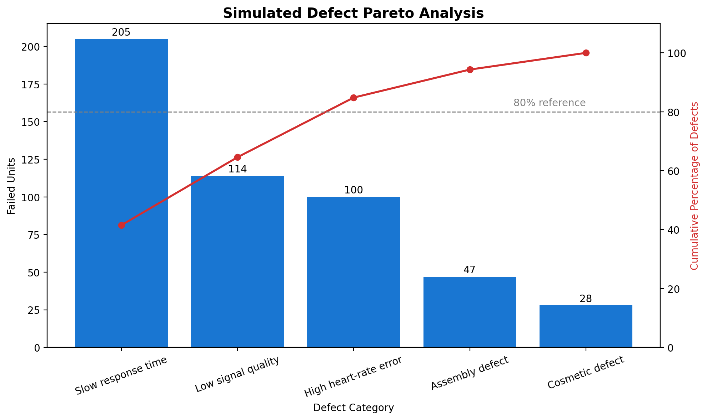
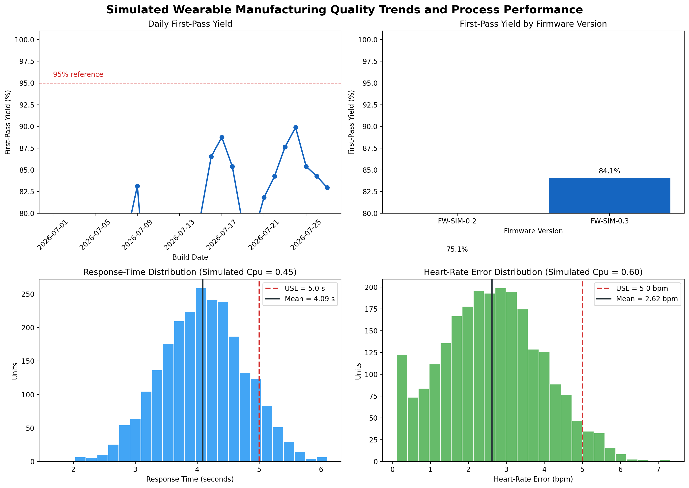

# Wearable Heart-Rate Manufacturing Quality Dashboard

A portfolio project demonstrating Python, SQL, statistical quality analysis, and CAPA-style investigation using **synthetic manufacturing data** for a simulated wearable heart-rate monitor.

> **Simulation notice:** All manufacturing records, device details, performance measures, requirements, quality findings, and CAPA actions in this repository are fictional and created for educational portfolio purposes only. This project is not associated with a real device, manufacturer, production process, clinical study, regulatory submission, or quality-system record.

## Project Objective

Analyze synthetic manufacturing and test data for a simulated wearable heart-rate monitor to identify quality trends, compare manufacturing segments and firmware configurations, assess exploratory process-performance metrics, and document a data-supported corrective-action investigation.

## Key Findings

| Finding | Simulated Result |
|---|---:|
| Total units analyzed | 2,400 |
| Overall first-pass yield | Approximately 79.5% |
| FPY, first 7 build days | 76.0% |
| FPY, final 7 eligible build days | 85.2% |
| FW-SIM-0.2 first-pass yield | 75.1% |
| FW-SIM-0.3 first-pass yield | 84.1% |
| FW-SIM-0.2 mean response time | 4.32 seconds |
| FW-SIM-0.3 mean response time | 3.84 seconds |
| Overall response-time screening index | Cpu = 0.45 |
| Overall heart-rate-error screening index | Cpu = 0.60 |

**Interpretation:** The simulated FW-SIM-0.3 configuration showed higher first-pass yield and lower mean response time than FW-SIM-0.2. The portfolio investigation treats the earlier firmware configuration and response-time variation as a simulated quality-improvement opportunity.

## Dashboard Visuals

### Defect Pareto Analysis



### Quality Trends and Process Performance



## Skills Demonstrated

- Python data generation and analysis with NumPy and pandas
- SQL analytics with SQLite
- Data validation and exploratory quality analysis
- First-pass yield, failure-rate, and rework-rate calculation
- Defect Pareto analysis
- Production-line, test-station, shift, and firmware comparisons
- Time-trend analysis and low-volume-day filtering
- Exploratory one-sided process-performance screening using \(C_{pu}\)
- CAPA-style investigation, five-why analysis, corrective actions, and effectiveness checks
- Reproducible analysis and version-controlled technical documentation

## Repository Structure

```text
wearable-heart-rate-manufacturing-quality-dashboard/
├── data/
│   └── synthetic_manufacturing_data.csv
├── notebooks/
│   ├── 01_generate_synthetic_data.ipynb
│   ├── 02_exploratory_quality_analysis.ipynb
│   ├── 03_quality_trends_and_process_performance.ipynb
│   └── 04_sql_quality_analysis.ipynb
├── sql/
│   └── 01_manufacturing_quality_analysis.sql
├── dashboards/
│   ├── defect_pareto.png
│   └── quality_trends_and_process_performance.png
└── docs/
    └── 01_simulated_capa_quality_investigation.md
```

## Analysis Workflow

1. Generate 2,400 reproducible synthetic manufacturing records for the simulated wearable monitor.
2. Validate data completeness, unit-ID uniqueness, and column types.
3. Calculate overall quality KPIs: first-pass yield, failure rate, and rework rate.
4. Compare quality performance by production line, test station, shift, and firmware version.
5. Rank simulated defect categories using a Pareto analysis.
6. Analyze daily FPY trends, excluding days with fewer than 20 tested units from the trend visualization.
7. Compare response-time and heart-rate-error distributions with simulated upper specification limits.
8. Calculate exploratory one-sided \(C_{pu}\) screening indices.
9. Reproduce manufacturing-quality KPIs and Pareto results in SQLite.
10. Translate results into a simulated CAPA-style investigation with containment, root-cause hypothesis, corrective/preventive actions, and effectiveness checks.

## Dataset Fields

| Field | Description |
|---|---|
| `unit_id` | Unique simulated wearable unit identifier |
| `build_date` | Simulated manufacturing build date |
| `production_line` | Simulated production line: Line A, Line B, or Line C |
| `shift` | Simulated production shift: Day or Evening |
| `test_station` | Simulated functional-test station |
| `firmware_version` | Simulated firmware configuration |
| `heart_rate_error_bpm` | Simulated absolute heart-rate estimate error in beats per minute |
| `response_time_seconds` | Simulated response time for a stable reference step change |
| `signal_quality_score` | Simulated signal-quality metric on a 0–100 scale |
| `test_status` | Simulated final test disposition: Pass or Fail |
| `defect_category` | Simulated defect category, if applicable |
| `rework_required` | Whether simulated rework was required |

## Reproduce the Analysis

The notebooks were developed in Google Colab and can be run in sequence:

1. `01_generate_synthetic_data.ipynb` creates the reproducible source dataset using a fixed random seed.
2. `02_exploratory_quality_analysis.ipynb` calculates baseline KPIs and produces the defect Pareto chart.
3. `03_quality_trends_and_process_performance.ipynb` analyzes daily yield, firmware performance, distributions, and exploratory screening indices.
4. `04_sql_quality_analysis.ipynb` loads the CSV into an in-memory SQLite database and executes the SQL analysis.
5. `sql/01_manufacturing_quality_analysis.sql` contains the standalone SQLite KPI, segmentation, daily-yield, and window-function Pareto queries.

## Process-Performance Notes

The project uses a one-sided exploratory screening index:

\[
C_{pu} = \frac{USL - \mu}{3\sigma}
\]

where \(USL\) is the upper specification limit, \(\mu\) is the sample mean, and \(\sigma\) is the sample standard deviation.

The simulated upper limits are:

- Response time: 5.00 seconds
- Heart-rate error: 5.00 bpm

These values are included to demonstrate analytical workflow only. They are **not** formal process-capability results because this exercise does not establish process stability, normality, a validated measurement system, or representative production sampling.

## CAPA-Style Investigation

The simulated investigation is documented in:

[`docs/01_simulated_capa_quality_investigation.md`](docs/01_simulated_capa_quality_investigation.md)

It connects the data analysis to a structured quality-engineering response:

- Defines a simulated problem statement and containment actions
- Reviews yield, firmware, defect, and response-time evidence
- Uses a simulated five-why root-cause analysis
- Proposes corrective and preventive actions
- Defines effectiveness checks and residual-risk limitations

A condensed project summary is available in [`docs/02_portfolio_summary.md`](docs/02_portfolio_summary.md).

## Tools

- Python
- pandas
- NumPy
- Matplotlib
- SQLite
- Google Colab
- GitHub

## Limitations

This is an educational project using intentionally fictional data. It does not demonstrate actual product performance, manufacturing quality, clinical performance, regulatory compliance, process validation, software validation, device clearance, or a real CAPA system.
